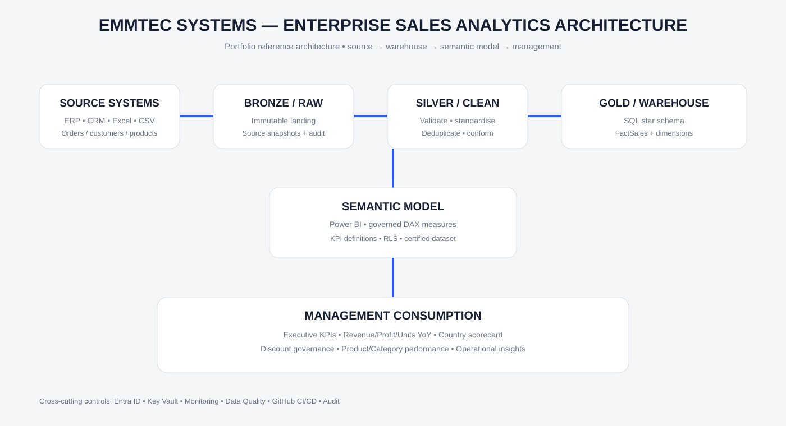
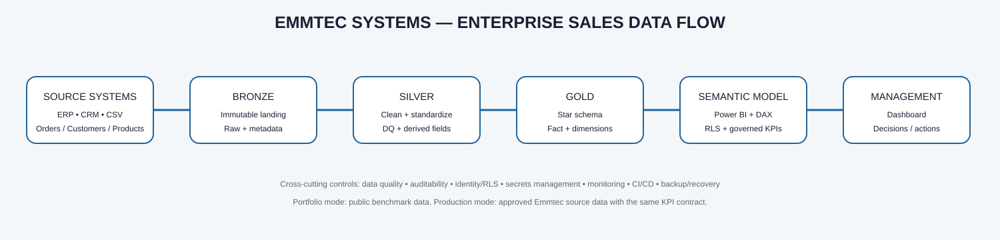

# EMMTEC SYSTEMS INTERNATIONAL — Enterprise Sales Performance Analytics

> **Portfolio benchmark / reference implementation.** This project demonstrates how an enterprise sales analytics solution can be designed for Emmtec Systems International using a public Sample/Global Superstore benchmark. It is **not a statement of Emmtec's confidential financial performance**.

## Executive purpose

The solution is designed around management questions:

1. What is revenue by country and geography?
2. How is revenue changing by date/year?
3. What are Revenue, Profit and Units Sold YoY?
4. How does discount band affect commercial performance?
5. Which country/market is growing or declining each year?
6. Which products, categories and customer segments create value?
7. What operational signals require management action?

## Benchmark KPI snapshot

| KPI | Benchmark result |
|---|---:|
| Revenue | $2,297,200.86 |
| Gross Profit | $286,397.02 |
| Profit Margin | 12.46% |
| Units Sold | 37,873 |
| Orders | 5,009 |
| Customers | 793 |
| Average Order Value | $458.59 |
| Best Year | 2017 — $733,215.26 |
| Top Region | West — $725,457.82 |
| Top Category by Profit | Technology — $145,454.95 |

## Revenue YoY

| Year | Revenue | YoY |
|---|---:|---:|
| 2014 | $484,247.50 | — |
| 2015 | $470,532.51 | -2.83% |
| 2016 | $609,205.60 | +29.46% |
| 2017 | $733,215.26 | +20.36% |

## Dashboard

Open `dashboard/executive_dashboard.html` in a browser. The dashboard includes:
- Executive KPI cards
- Revenue trend and YoY table
- Discount governance view
- Regional revenue comparison
- Category profitability
- Region × Year management scorecard
- Management action register

## Architecture





Production target:

`ERP / CRM → Bronze → Silver → Gold Warehouse → Power BI Semantic Model → Management`

The architecture is intentionally compatible with an Azure/Fabric target: Data Factory/Fabric Data Factory, ADLS Gen2/OneLake, Azure SQL/Fabric Warehouse, Power BI, Entra ID, Key Vault, monitoring and GitHub CI/CD.

## Repository structure

```text
architecture/
  architecture_diagram.svg
  data_flow.svg
  README_ARCHITECTURE.md
  azure_reference_architecture.md
  management_architecture.md
  powerbi_star_schema.md

sql/
  01_create_schema.sql
  02_derived_fields.sql
  03_kpis.sql
  04_yoy_analysis.sql
  05_management_scorecard.sql
  emmtec_sales_model.sql

powerbi/
  measures.dax
  model_spec.md
  theme.json

pipeline/
  README.md
  load_template.sql

management/
  benchmark_insights.md

tests/
  sql_validation.sql
  validate_repo.py

dashboard/
  executive_dashboard.html
```

## SQL implementation

The SQL layer separates responsibilities:

- `01_create_schema.sql` — warehouse table and indexes.
- `02_derived_fields.sql` — Year, Quarter, Month, DiscountBand, Margin and DeliveryDays.
- `03_kpis.sql` — executive KPI, category, segment and shipping metrics.
- `04_yoy_analysis.sql` — annual and monthly Revenue/Profit/Units YoY analysis.
- `05_management_scorecard.sql` — Country × Year, Region × Year and discount governance.
- `tests/sql_validation.sql` — structural, date, range and reconciliation checks.

## Power BI implementation

The semantic model follows a star schema with FactSales surrounded by Date, Customer, Product, Geography, Shipping and Discount dimensions. Microsoft recommends star-schema modeling for Power BI because dimensions provide filtering/grouping context while facts provide summarization. citeturn0search0

Included:
- `powerbi/measures.dax` — governed executive measures.
- `powerbi/model_spec.md` — tables, relationships, report pages, RLS and refresh design.
- `powerbi/theme.json` — executive report theme.

## Data quality and governance

The production pattern includes:
- Primary/business-key duplicate detection
- Required-field validation
- Date integrity checks
- Discount range checks
- Revenue/profit/unit reconciliation
- Incremental load by watermark
- Bronze/Silver/Gold separation
- RLS by geography
- Secrets outside source control
- DEV → TEST/UAT → PROD deployment
- Monitoring and recovery controls

## Management benchmark findings

- Revenue dipped in 2015 and then accelerated strongly in 2016 and 2017.
- West and East are the largest benchmark revenue regions.
- Technology contributes the highest category profit.
- Furniture has comparatively low profit contribution and warrants sub-category/discount investigation.
- Standard Class is the dominant shipping mode.
- Discount should be governed as a margin lever; high discount transactions should be reviewed rather than evaluated on revenue alone.

See `management/benchmark_insights.md` for the full action register.

## Data provenance

The benchmark uses the public Sample/Global Superstore family of datasets. The source repository provides Global Superstore order data in CSV/XLSX/SQL forms; public documentation and other published analyses identify the dataset as an educational/sample dataset rather than confidential corporate data.

Reference sources:
- Tableau Sample Superstore ecosystem
- Global Superstore public repository: `andrewmanueld/dataset_global_superstore_2016`
- Kaggle Global Superstore dataset

The benchmark figures in this repository are used for portfolio demonstration. They must not be represented as Emmtec actuals.

## Productionization roadmap

### Phase 1 — Completed
- Management requirements mapped to KPIs
- SQL warehouse model
- KPI/YoY/scorecard queries
- Executive HTML dashboard
- Power BI semantic model and DAX pack
- Enterprise architecture and data flow
- Data-quality controls
- CI quality check

### Phase 2 — When approved Emmtec data is available
- Connect ERP/CRM source
- Implement Bronze ingestion
- Apply Silver transformations
- Reconcile Gold warehouse totals to source control totals
- Publish Power BI semantic model
- Configure Entra ID/RLS
- Schedule refresh and monitoring

### Phase 3 — Enterprise optimization
- Incremental refresh/partitioning
- Data lineage and catalog
- Cost monitoring
- SLA/SLO reporting
- Automated anomaly detection
- Forecasting and scenario analysis

## How to use

1. Open `dashboard/executive_dashboard.html` for the management presentation.
2. Review `architecture/README_ARCHITECTURE.md` for the enterprise target.
3. Execute SQL scripts in order against SQL Server.
4. Load approved source data into `analytics.fact_sales`.
5. Run `tests/sql_validation.sql`.
6. Configure the Power BI model using `powerbi/model_spec.md` and `powerbi/measures.dax`.
7. Replace benchmark data with approved Emmtec data before operational use.

## Portfolio note

This repository demonstrates end-to-end capability across **business analysis, SQL, dimensional modeling, Power BI architecture, data engineering, governance, dashboard design and executive storytelling** while keeping confidential company data out of a public GitHub repository.
